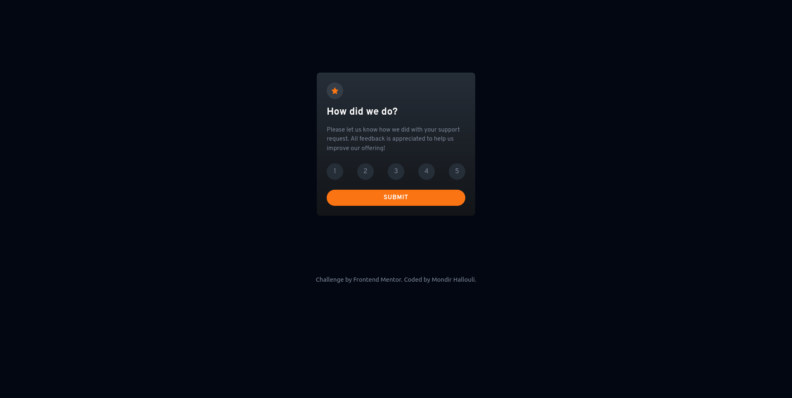

# Frontend Mentor - Interactive rating component solution

This is a solution to the [Interactive rating component challenge on Frontend Mentor](https://www.frontendmentor.io/challenges/interactive-rating-component-koxpeBUmI). Frontend Mentor challenges help you improve your coding skills by building realistic projects. 

## Table of contents

- [Overview](#overview)
  - [The challenge](#the-challenge)
  - [Screenshot](#screenshot)
  - [Links](#links)
- [My process](#my-process)
  - [Built with](#built-with)
  - [What I learned](#what-i-learned)
- [Author](#author)

## Overview

### The challenge

Users should be able to:

- View the optimal layout for the app depending on their device's screen size
- See hover states for all interactive elements on the page
- Select and submit a number rating
- See the "Thank you" card state after submitting a rating

### Screenshot

### Links

- Solution URL: [Add solution URL here](https://github.com/mondirhallouli/interactive-rating-component)
- Live Site URL: [Add live site URL here](https://interactive-rating-component-5hm.pages.dev/)

## My process

### Built with

- Semantic HTML5 markup
- Flexbox
- Mobile-first workflow
- [React](https://reactjs.org/) - JS library
- [TailwindCSS](https://tailwindcss.com/) - For styles

### What I learned

- This was a great project to review my react basics, especially state management and avoiding prop drilling. I had to immitate a real situation where the component would actually take the review and send it to a database to collect it. I thought at first I would use react-router but after more thinking I realized it was overkill for a small project such as this. I ended up using just simple state management and conditional rendering to display the right component.

## Author

- Website - [portfolio website](https://www.mh-portfolio.pages.com)
- Frontend Mentor - [@yourusername](https://www.frontendmentor.io/profile/mondirhallouli)
- LinkedIn- [@mondirhallouli](https://www.linkedin.com/in/mondir-hallouli)
